<p align="center">
  <strong>Clarus</strong>
</p>

<p align="center">
  Healthcare workflow automation platform — AI-powered patient outreach, lab follow-up, and appointment scheduling.
</p>

<p align="center">
  
  
  
  
  
  
  
  
</p>

---

## Overview

Clarus helps clinicians automate patient follow-up through:

- **Visual workflow builder** — Drag-and-drop design of triggers, conditions, and actions (React Flow)
- **AI voice calls** — ElevenLabs Conversational AI + Twilio for outbound patient outreach
- **Event-driven execution** — Lab events, PDF uploads, or manual triggers run workflows automatically
- **Patient management** — Full CRUD with ICD-10/HCC conditions, medications, RAF scoring, Beacon AI insights
- **PDF intake** — Extract patient info and lab results from documents; run workflows with extracted data
- **Google Calendar** — Create appointments when patients confirm during AI calls
- **Audit trail** — Execution logs, call transcripts, and reports for every workflow run

The frontend connects to the FastAPI backend via REST. The workflow engine walks the graph, evaluates conditions, and dispatches actions (call patient, send SMS, create lab order, etc.). ElevenLabs webhooks update call logs and trigger calendar events.

---

## System Architecture

```mermaid
graph TB
    subgraph Frontend["FRONTEND — Next.js 16 + React 19"]
        direction TB
        Landing["/ Landing, About, Features, Pricing"]
        Auth["(auth) Auth0 Sign-In / Sign-Up"]

        subgraph Dashboard["App Routes — Protected by Auth0"]
            DashView["/dashboard — Stats, Patients, PDF Import"]
            Patients["/patients — Patient Directory"]
            PatientDetail["/patients/[id] — Profile, Conditions, Meds"]
            Workflow["/workflow — Workflow Builder"]
            Triggers["/triggers — Workflow Triggers"]
            Calls["/calls — Call Logs"]
            Appointments["/appointments — Calendar"]
            AuditLog["/audit-log — Activity"]
            Settings["/settings — Profile, Notifications"]
        end

        subgraph FComponents["Components"]
            WorkflowBuilder["WorkflowBuilder — React Flow"]
            NodePalette["NodePalette"]
            TriggerNode["TriggerNode, ActionNode, ConditionalNode"]
            EndpointNode["EndpointNode"]
            Sidebar["Sidebar, Topbar"]
            Hero["Hero, Features, CTA"]
        end

        subgraph FServices["Services"]
            ApiClient["api.ts — fetch to backend"]
        end
    end

    subgraph Backend["BACKEND — FastAPI + Python"]
        direction TB
        subgraph API["REST Endpoints"]
            PatientsAPI["/api/patients"]
            WorkflowsAPI["/api/workflows"]
            ExecuteAPI["/api/workflows/{id}/execute"]
            LabEventAPI["/api/lab-event"]
            CallLogsAPI["/api/call-logs"]
            PDFAPI["/api/pdf/*"]
            WebhookAPI["/api/elevenlabs/webhook"]
            TwilioAPI["/api/twilio/voice, gather"]
        end

        subgraph Services["Services"]
            WorkflowEngine["Workflow Engine — graph traversal"]
            SupabaseSvc["Supabase Service — CRUD"]
            ElevenLabsSvc["ElevenLabs Service — outbound calls"]
            PDFSvc["PDF Service — extraction"]
            CalendarSvc["Google Calendar Service"]
        end
    end

    subgraph External["EXTERNAL SERVICES"]
        Supabase["Supabase PostgreSQL"]
        ElevenLabs["ElevenLabs ConvAI API"]
        Twilio["Twilio Voice/SMS"]
        GoogleCal["Google Calendar API"]
        Auth0Ext["Auth0"]
    end

    Auth -.-> Auth0Ext
    ApiClient -->|REST| API
    WorkflowBuilder -->|save nodes/edges| WorkflowsAPI
    DashView -->|list patients, workflows, calls| PatientsAPI
    LabEventAPI --> WorkflowEngine
    ExecuteAPI --> WorkflowEngine
    WorkflowEngine --> SupabaseSvc
    WorkflowEngine --> ElevenLabsSvc
    WorkflowEngine --> CalendarSvc
    WebhookAPI --> SupabaseSvc
    WebhookAPI --> CalendarSvc

    SupabaseSvc -.-> Supabase
    ElevenLabsSvc -.-> ElevenLabs
    Twilio -.-> ElevenLabs
    CalendarSvc -.-> GoogleCal
```



---

## Tech Stack

| Layer | Technologies | How We Use It |
|-------|--------------|---------------|
| **Frontend** | Next.js 16, React 19, TypeScript 5, Tailwind CSS 4 | App Router with protected routes, server/client components, responsive UI |
| **Workflow UI** | React Flow (@xyflow/react), Dagre | Visual workflow builder with drag-and-drop nodes and edges |
| **Authentication** | Auth0 (`@auth0/auth0-react`) | Sign-in/sign-up, `user.sub` as `doctor_id` for data scoping |
| **Backend** | FastAPI, Uvicorn, Python 3.12+ | REST API, Pydantic schemas, async handlers |
| **Database** | Supabase (PostgreSQL) | Workflows, patients, conditions, medications, call_logs, pdf_documents |
| **Voice AI** | ElevenLabs Conversational AI | Outbound AI voice calls via Twilio; webhook for call outcomes |
| **Telephony** | Twilio | Voice calls (ElevenLabs integration), SMS fallback |
| **Calendar** | Google Calendar API | Create events when patients confirm appointments during AI calls |
| **PDF Parsing** | pdfplumber, pdfminer.six, pypdfium2 | Extract patient info, lab results, tables from medical PDFs |
| **HTTP Client** | httpx | Async requests to ElevenLabs, Google APIs |
| **UI** | shadcn/ui, Lucide React | Buttons, modals, icons across dashboard and app |
| **3D** | Three.js, React Three Fiber, Drei | Marketing page visuals (sphere, particles) |
| **Deployment** | Vercel, Render | Frontend on Vercel; backend on Render (uvicorn) |

---

## Project Structure

### Frontend

```
frontend/
├── app/                              # Next.js App Router
│   ├── layout.tsx                    # Root layout with Auth0Provider
│   ├── globals.css                   # Tailwind theme
│   ├── (auth)/                       # Auth routes
│   │   ├── signIn/[[...sign-in]]/page.tsx
│   │   └── signUp/[[...sign-up]]/page.tsx
│   ├── (marketing)/                  # Public marketing
│   │   ├── page.tsx                  # Landing
│   │   ├── about/page.tsx
│   │   ├── features/page.tsx
│   │   ├── pricing/page.tsx
│   │   └── contact/page.tsx
│   ├── (app)/                        # Protected app routes
│   │   ├── dashboard/page.tsx       # Stats, patients, PDF import, workflows
│   │   ├── patients/page.tsx        # Patient directory
│   │   ├── patients/[patientId]/page.tsx  # Patient profile, conditions, meds
│   │   ├── calls/page.tsx           # Call logs
│   │   ├── appointments/page.tsx    # Calendar view
│   │   ├── triggers/page.tsx        # Workflow triggers list
│   │   ├── triggers/[triggerId]/page.tsx
│   │   ├── triggers/new/page.tsx
│   │   ├── audit-log/page.tsx       # Activity log
│   │   └── settings/                # Profile, notifications
│   └── (workflow)/
│       └── workflow/page.tsx         # Workflow builder
├── components/
│   ├── app/                          # Sidebar, Topbar
│   ├── marketing/                   # Hero, Features, CTA, Footer
│   ├── workflow/                    # WorkflowBuilder, NodePalette, nodes
│   └── ui/                          # Button, etc.
├── services/
│   └── api.ts                       # Backend API client (fetch)
├── lib/
│   ├── supabase.ts                  # Supabase client
│   └── utils.ts
├── types/
└── middleware.ts                    # Auth0 route protection
```

### Backend

```
backend/
├── main.py                           # FastAPI app, CORS, router
├── app/
│   ├── api/
│   │   └── endpoints.py             # All REST routes
│   ├── core/
│   │   └── config.py                 # Pydantic settings
│   └── services/
│       ├── supabase_service.py       # DB CRUD
│       ├── workflow_engine.py        # Graph execution
│       ├── elevenlabs_service.py     # Outbound calls
│       ├── google_calendar_service.py
│       └── pdf_service.py            # PDF extraction
├── migrations/
│   └── 001_create_new_tables.sql
├── requirements.txt
├── Procfile                          # uvicorn for Render
└── .env.example
```

---

## Data Flows

### 1. Lab Event → Workflow Execution → AI Call

```
Lab System / Manual Simulation
    │ POST /api/lab-event {trigger_type, patient_id}
    ▼
┌─ Backend ─────────────────────────────────────┐
│  Query enabled workflows by trigger_type       │
│  Load patient from Supabase                   │
│  execute_workflow() — graph traversal          │
│    → trigger → conditions → actions            │
│    → call_patient action                       │
│    → ElevenLabs initiate_outbound_call()       │
└───────────────────────────────────────────────┘
    │
    ▼
ElevenLabs + Twilio → Patient Phone (AI conversation)
    │
    │ POST /api/elevenlabs/webhook (call ended)
    ▼
Update call_log, create Google Calendar event if confirmed
```

### 2. PDF Extract & Execute

```
PDF Upload (lab report)
    │ POST /api/pdf/extract-and-execute {file, patient_id, workflow_id}
    ▼
┌─ Backend ─────────────────────────────────────┐
│  pdf_service: extract text + tables           │
│  Parse patient info (name, DOB, MRN, phone)   │
│  Parse lab results (test_name, value, unit)    │
│  Store in pdf_documents                        │
│  execute_workflow() with lab_results in context│
└───────────────────────────────────────────────┘
```

### 3. Manual Workflow Execution

```
Dashboard / Patient Profile
    │ POST /api/workflows/{id}/execute {patient_id}
    ▼
Workflow Engine → same flow as Lab Event
```

### 4. Twilio Voice Webhook (Inbound)

```
Patient answers call
    │ Twilio → POST /api/twilio/voice
    ▼
Return TwiML to connect to ElevenLabs
    │
    │ Twilio → POST /api/twilio/gather (if DTMF)
    ▼
Process input, return TwiML
```

---

## Routes & Protection

| Route | Purpose | Protection |
|-------|---------|------------|
| `/` | Landing page | Public |
| `/about`, `/features`, `/pricing`, `/contact` | Marketing | Public |
| `/signIn`, `/signUp` | Auth | Public |
| `/dashboard` | Stats, patients, workflows, PDF import | Auth0 |
| `/patients` | Patient directory | Auth0 |
| `/patients/[id]` | Patient profile, conditions, medications | Auth0 |
| `/workflow` | Workflow builder | Auth0 |
| `/triggers` | Workflow triggers list | Auth0 |
| `/calls` | Call logs | Auth0 |
| `/appointments` | Calendar | Auth0 |
| `/audit-log` | Activity log | Auth0 |
| `/settings` | Profile, notifications | Auth0 |

---

## REST API Endpoints

| Endpoint | Method | Purpose |
|----------|--------|---------|
| `/health` | GET | Health check |
| `/api/patients` | GET, POST | List, create patients |
| `/api/patients/{id}` | GET, PUT, DELETE | Get, update, delete patient |
| `/api/patients/{id}/conditions` | GET, POST | List, create conditions |
| `/api/patients/{id}/conditions/{cid}` | PUT, DELETE | Update, delete condition |
| `/api/patients/{id}/medications` | GET, POST | List, create medications |
| `/api/patients/{id}/medications/{mid}` | PUT, DELETE | Update, delete medication |
| `/api/patients/{id}/import-pdf` | POST | Import PDF to patient |
| `/api/workflows` | GET, POST | List, create workflows |
| `/api/workflows/{id}` | GET, PUT, DELETE | Get, update, delete workflow |
| `/api/workflows/{id}/execute` | POST | Execute workflow for patient |
| `/api/lab-event` | POST | Simulate lab event, run workflows |
| `/api/call-logs` | GET | List call logs |
| `/api/call-logs/{id}/check` | POST | Poll ElevenLabs for call status |
| `/api/elevenlabs/webhook` | POST | ElevenLabs post-call webhook |
| `/api/twilio/voice` | POST | Twilio voice TwiML |
| `/api/twilio/gather` | POST | Twilio gather TwiML |
| `/api/pdf/upload` | POST | Upload PDF |
| `/api/pdf/intake` | POST | PDF intake (create patient) |
| `/api/pdf/extract-and-execute` | POST | Extract + run workflow |
| `/api/pdf/documents` | GET | List PDF documents |
| `/api/pdf/documents/{id}` | GET, DELETE | Get, delete document |
| `/api/notifications` | GET | List notifications |
| `/api/lab-orders` | GET | List lab orders |
| `/api/referrals` | GET | List referrals |
| `/api/staff-assignments` | GET | List staff assignments |
| `/api/reports` | GET | List reports |
| `/api/reports/{id}` | GET | Get report |

---

## Database Schema (Core Tables)

```
workflows              patients              call_logs
├── id                 ├── id                ├── id
├── doctor_id          ├── doctor_id         ├── workflow_id
├── name               ├── name, phone       ├── patient_id
├── nodes (JSONB)      ├── dob, mrn          ├── status, outcome
├── edges (JSONB)      ├── insurance         └── execution_log (JSONB)
└── status             └── risk_level
        │                       │
        └───────────────────────┼──► patient_conditions
                                ├── patient_medications
                                ├── pdf_documents
                                ├── notifications
                                ├── lab_orders
                                ├── referrals
                                ├── staff_assignments
                                └── reports
```

---

## Environment Variables

### Frontend (`frontend/.env.local`)

| Variable | Purpose |
|----------|---------|
| `NEXT_PUBLIC_API_URL` | Backend URL (default `http://localhost:8000`) |
| `NEXT_PUBLIC_AUTH0_DOMAIN` | Auth0 tenant domain |
| `NEXT_PUBLIC_AUTH0_CLIENT_ID` | Auth0 client ID |
| `NEXT_PUBLIC_SUPABASE_URL` | Supabase project URL |
| `NEXT_PUBLIC_SUPABASE_ANON_KEY` | Supabase anon key |

### Backend (`backend/.env`)

| Variable | Purpose |
|----------|---------|
| `SUPABASE_URL` | Supabase project URL |
| `SUPABASE_SERVICE_ROLE_KEY` | Supabase service role key |
| `TWILIO_ACCOUNT_SID` | Twilio account SID |
| `TWILIO_AUTH_TOKEN` | Twilio auth token |
| `TWILIO_PHONE_NUMBER` | Twilio phone number |
| `ELEVENLABS_API_KEY` | ElevenLabs API key |
| `ELEVENLABS_AGENT_ID` | ElevenLabs agent ID |
| `ELEVENLABS_PHONE_NUMBER_ID` | ElevenLabs phone number ID |
| `AUTH0_DOMAIN` | Auth0 tenant domain |
| `AUTH0_CLIENT_ID` | Auth0 application client ID |
| `AUTH0_CLIENT_SECRET` | Auth0 application client secret |
| `AUTH0_M2M_CLIENT_ID` | Auth0 M2M app (for Google tokens) |
| `AUTH0_M2M_CLIENT_SECRET` | Auth0 M2M app secret |
| `APP_BASE_URL` | Backend base URL (for webhooks) |

---

## Getting Started

### Prerequisites

- **Node.js** 18+ and **npm**
- **Python** 3.12+
- Accounts: Supabase, Auth0, Twilio, ElevenLabs, Google Cloud

### Backend

```bash
cd backend
pip install -r requirements.txt

# Configure environment
cp .env.example .env
# Edit .env with your credentials

# Start the server
uvicorn main:app --reload --port 8000
# → Runs on http://localhost:8000
# → Docs at http://localhost:8000/docs
```

### Frontend

```bash
cd frontend
npm install

# Configure environment
# Create .env.local with Auth0, API URL, Supabase keys

# Start development server
npm run dev
# → Runs on http://localhost:3000
```

### Quick Test

1. Open `http://localhost:3000` → sign in via Auth0
2. Navigate to `/dashboard` → add a patient, view workflows
3. Open `/workflow` → build a workflow (trigger → condition → call patient)
4. Run workflow manually or simulate a lab event via `POST /api/lab-event`

---

## Deployment

- **Frontend**: Vercel (Next.js)
- **Backend**: Render (Python, `uvicorn main:app --host 0.0.0.0 --port $PORT`)
- **Database**: Supabase (hosted PostgreSQL)
- **Auth**: Auth0

See `render.yaml` for Render configuration.

---

## Summary

| What | How |
|------|-----|
| **Frontend** | Next.js 16 app with Auth0, dashboard, patients, workflow builder, call logs |
| **Backend** | FastAPI with workflow engine, Supabase, ElevenLabs, Twilio, Google Calendar |
| **Workflows** | Triggers → conditions → actions; stored as nodes/edges in Supabase |
| **Execution** | Lab event, PDF upload, or manual → workflow engine → actions (call, SMS, etc.) |
| **AI Calls** | ElevenLabs ConvAI + Twilio → patient phone → webhook → call_log + calendar |
| **PDF** | pdfplumber extraction → patient + lab data → workflow context |

Clarus automates patient outreach from clinical events to AI voice calls and calendar booking.

---

## License

See [LICENSE](LICENSE) for details.
