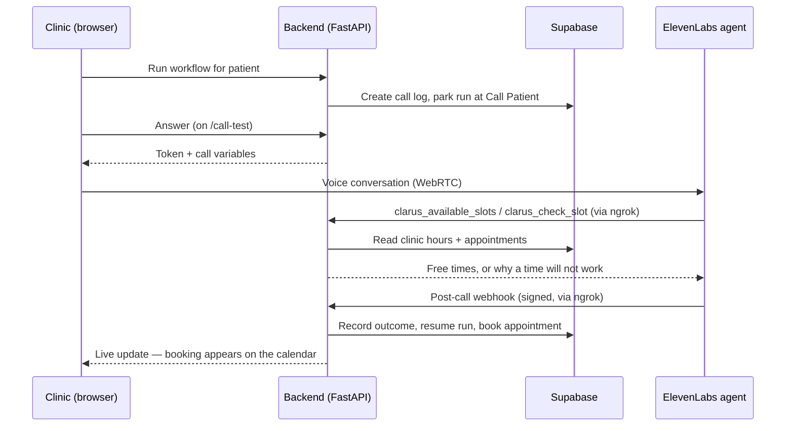

<p align="center">
  <strong>Clarus</strong>
</p>

<p align="center">
  Healthcare workflow automation — AI voice calls that follow up with patients and book them into free appointment slots.
</p>

<p align="center">
  
  
  
  
  
  
</p>

---

## What it does

A clinic imports a patient (by hand or from a PDF), builds a workflow, and runs
it. When the workflow reaches **Call Patient**, an AI agent speaking Bangla calls
the patient, confirms who they are, looks up the clinic's calendar *during the
call*, offers only times that are actually free, and books the one the patient
agrees to. The booking appears on the clinic's calendar a few seconds after
hang-up.

- **Workflow builder** — drag-and-drop triggers, conditions and actions (React Flow).
- **AI calls with a live calendar** — the agent checks free slots and any time the
  patient proposes against the clinic's hours and existing appointments, and
  explains when a time will not work (closed that day, outside hours, already booked).
- **Practice settings** — each doctor sets their clinic's opening hours,
  appointment length, and the doctor and practice names the agent says.
- **Appointments calendar** — a week view of every booking, AI-booked and
  hand-added, in clinic time.
- **PDF intake** — create a patient from a lab report. Parsed locally with fixed
  patterns; the document is never sent to an AI model.
- **Safety gates** — a calls kill switch, calling hours, a per-patient attempt cap,
  a fixed vocabulary of call reasons, and prompt-injection defences. See
  [docs/ai-call-safety-policy.md](docs/ai-call-safety-policy.md).
- **Audit trail** — execution logs, transcripts and an audit log per practice.

### Status

| Works today | Not yet |
|---|---|
| Browser calls (`CALL_TRANSPORT=web`) end to end: workflow → call → calendar lookups → booking | Calls to a real phone — the WhatsApp/Twilio paths are built but wait on a business number |
| PDF intake, patients, conditions, medications, workflows | Google Calendar sync (the calendar is Clarus's own) |
| Clinic hours, practice profile, appointments calendar | SMS (the `send_sms` node deliberately fails) |
| Live updates over server-sent events | Per-practice timezones (one `DEFAULT_TIMEZONE` for everyone) |

More detail: [docs/progress.md](docs/progress.md) and [docs/backend-status.md](docs/backend-status.md).

---

## How a call works


```mermaid
sequenceDiagram
    participant Staff as Clinic (browser)
    participant API as Backend (FastAPI)
    participant DB as Supabase
    participant EL as ElevenLabs agent

    Staff->>API: Run workflow for patient
    API->>DB: Create call log, park run at Call Patient
    Staff->>API: Answer (on /call-test)
    API-->>Staff: Token + call variables
    Staff->>EL: Voice conversation (WebRTC)
    EL->>API: clarus_available_slots / clarus_check_slot (via ngrok)
    API->>DB: Read clinic hours + appointments
    API-->>EL: Free times, or why a time will not work
    EL->>API: Post-call webhook (signed, via ngrok)
    API->>DB: Record outcome, resume run, book appointment
    API-->>Staff: Live update — booking appears on the calendar
```

With no phone number yet, calls run in the browser: **Answer** on `/call-test`
plays the patient's phone. When a WhatsApp or Twilio number is available, set
`CALL_TRANSPORT` and the same workflow rings a real phone — nothing else changes.

---

## Running it locally

### Prerequisites

- **Python 3.12+**, **Node.js 18+**, **ngrok** (`ngrok version` to check)
- Accounts: **Supabase**, **Clerk**, **ElevenLabs**, **ngrok** (free)

### One-time setup

**1. Backend**

```powershell
cd backend
python -m venv .venv
.venv\Scripts\Activate.ps1            # macOS/Linux: source .venv/bin/activate
pip install -e ".[dev]"
copy .env.example .env                # macOS/Linux: cp .env.example .env
```

Fill in `backend/.env` — every variable is explained in
[backend/.env.example](backend/.env.example). For browser calls you need at least:

```ini
SUPABASE_URL=...
SUPABASE_SERVICE_ROLE_KEY=...
CLERK_ISSUER=...
ELEVENLABS_API_KEY=...
ELEVENLABS_AGENT_ID=...               # printed by the agent sync below
ELEVENLABS_WEBHOOK_SECRET=...         # from the ElevenLabs webhook, step 5
CALL_TRANSPORT=web
CALLS_ENABLED=true
PRACTICE_CALLBACK_NUMBER=+8801...     # a real number you control
ELEVENLABS_TOOL_SECRET=...            # python -c "import secrets; print(secrets.token_urlsafe(32))"
PUBLIC_API_URL=https://<your-domain>.ngrok-free.dev
```

If PowerShell refuses to run `Activate.ps1`, run
`Set-ExecutionPolicy -Scope Process -ExecutionPolicy RemoteSigned` first.

**2. Database** — in the Supabase **SQL Editor**, run each file in
[backend/migrations/](backend/migrations/) **in order**:

| File | Adds |
|---|---|
| `000_initial_schema.sql` | All tables |
| `001_rls.sql` | Row Level Security |
| `002_call_outcomes.sql` | Structured call results |
| `003_browser_calls.sql` | Calls answered in the browser |
| `004_practice_hours.sql` | Clinic hours and appointment length |

**3. Frontend**

```powershell
cd frontend
npm install
copy .env.example .env.local          # then fill in the Clerk keys
```

The Clerk keys must come from the **same Clerk instance** as the backend's
`CLERK_ISSUER`, or every request 401s.

**4. ngrok** — ElevenLabs has to reach your backend from the internet twice per
call: the calendar lookups *during* the call and the result webhook *after* it.
ngrok gives your laptop a public HTTPS address for that.

1. Sign up at [ngrok.com](https://ngrok.com), choose **Share Localhost**, and
   copy your authtoken from the dashboard:
   ```powershell
   ngrok config add-authtoken <your-authtoken>
   ```
2. In the ngrok dashboard → **Domains**, claim your free **static domain**
   (e.g. `something.ngrok-free.dev`). It never changes, so everything below is
   configured once.
3. Put it in `backend/.env` as `PUBLIC_API_URL=https://<your-domain>`.

Skip the "secure your endpoint" / `--traffic-policy-file` step of ngrok's
getting-started page: it puts a login in front of the URL, which ElevenLabs
cannot pass. The backend authenticates both routes itself (a signature on the
webhook, a shared secret on the tools).

**5. ElevenLabs**

1. **Webhook** — ElevenLabs → back to workspace → **Settings** → *Post-call
   webhook* (or Developers → Webhooks). URL:
   `https://<your-domain>/api/elevenlabs/webhook`, HMAC authentication,
   transcription events on. Copy the secret into `ELEVENLABS_WEBHOOK_SECRET`.
2. **Agent** — the agent's prompt, tools and data fields live in
   [backend/agents/](backend/agents/), not in the dashboard. Push them (with the
   backend venv active, from `backend/`):
   ```powershell
   $env:PYTHONIOENCODING="utf-8"      # Bangla on a Windows console
   python scripts\sync_agent.py --spec agents\appointment_confirmation_bn.yaml --dry-run
   python scripts\sync_agent.py --spec agents\appointment_confirmation_bn.yaml
   ```
   It must end with **"Tools attached: 2"**. On the very first run it creates
   the agent and prints an id — put it in `ELEVENLABS_AGENT_ID` and run it again.

   Re-run the sync whenever a file in `agents/` changes or `PUBLIC_API_URL` changes.

**6. In the app** (after starting everything below) — open **Settings** and fill in:

- **Practice profile** — the doctor's name and the clinic's name the agent says
  ("an automated call from *[clinic]* on behalf of *[doctor]*").
- **Clinic hours** — open days and times, and the appointment length. Until
  these are saved the agent offers no times and tells the patient the practice
  will call back.

### Every time: start three terminals

Start them in this order, each from the repository root.

**Terminal 1 — backend**
```powershell
cd backend
.venv\Scripts\Activate.ps1
python -m uvicorn app.main:app --port 8000 --timeout-graceful-shutdown 2
```
Wait for `Application startup complete.` Add `--reload` while editing backend
code; leave it off when recording a demo.

**Terminal 2 — ngrok** (port **8000**, the backend's — not 80)
```powershell
ngrok http 8000 --url https://<your-domain>.ngrok-free.dev
```
The `Forwarding` line must end in `-> http://localhost:8000`.

**Terminal 3 — frontend**
```powershell
cd frontend
npm run dev
```
Open **http://localhost:3000**.

**Check the chain:** `https://<your-domain>.ngrok-free.dev/docs` should show
the API docs. **http://127.0.0.1:4040** is ngrok's inspector — every tool call
and webhook ElevenLabs sends appears there, with its status code.

### Try a call

1. **Dashboard** → import a patient PDF (see *Demo data* below).
2. **Workflow** → build *Follow-Up Due → Call Patient → Schedule Appointment →
   Send Summary to Doctor* (set **Reason for the Call** on Call Patient), save,
   and run it for the patient. Call Patient shows **parked**.
3. **http://localhost:3000/call-test** → under **Waiting to be answered**, click
   **Answer** and allow the microphone. You are the patient.
4. Ask about a full day, a closed day, a time after hours; then accept a time
   the agent offers.
5. Hang up. The booking appears on **Appointments** within seconds.

Use **Answer** for workflow calls. **Start a call yourself** on the same page is a
standalone test with no workflow — it records the outcome but never books.

### Demo data

[backend/scripts/seed_demo.py](backend/scripts/seed_demo.py) (venv active, from `backend/`):

```powershell
python scripts\seed_demo.py pdfs    # 4 synthetic patient PDFs -> demo/pdfs/
python scripts\seed_demo.py week    # fill the next 5 open days: one nearly full, one full, ...
python scripts\seed_demo.py clear   # remove only what `week` added
```

`week` books against your saved clinic hours starting tomorrow, so re-run
`clear` then `week` on the day you record. Its appointments belong to placeholder
patients named "Demo …"; `clear` never touches real bookings.

### Troubleshooting

| Symptom | Cause and fix |
|---|---|
| Pages hang, saves never finish | A stuck backend process holds port 8000. Ctrl+C every backend terminal, start one again. `--timeout-graceful-shutdown 2` prevents it. |
| Call stays `in_progress` after hang-up | The webhook is not arriving. Check http://127.0.0.1:4040: nothing there = wrong URL in ElevenLabs or ngrok not running; 401 = `ELEVENLABS_WEBHOOK_SECRET` mismatch. |
| Agent says it cannot check availability | 401 on `/api/elevenlabs/tools/...` in the inspector = re-run the agent sync; `ok:false` = clinic hours not saved in Settings. |
| ngrok shows 502 | ngrok is forwarding the wrong port — use `ngrok http 8000`. |
| "Stopped by a safety rule … called 3 time(s)" | The per-patient cap. Use another patient, or raise `MAX_CALL_ATTEMPTS_PER_PATIENT` in `.env` while testing. |
| Workflow blocked: calls switched off / outside calling window | `CALLS_ENABLED=true`; `CALLING_HOURS_START`/`END` are in `DEFAULT_TIMEZONE` (Asia/Dhaka). |
| A call finished but nothing was booked | It was started with *Start a call yourself*, not **Answer** on a workflow call. |
| Every API call 401s | Frontend and backend point at different Clerk instances. |

### Tests

```powershell
cd backend
python -m pytest            # the suite never reads backend/.env
cd ..\frontend
npx tsc --noEmit; npx eslint .
```

---

## Architecture

| Layer | Technology | Notes |
|---|---|---|
| Frontend | Next.js 16, React 19, TypeScript, Tailwind CSS 4, shadcn/ui | `proxy.ts` protects every app route (deny by default) |
| Workflow UI | React Flow (`@xyflow/react`), dagre | |
| Calls in the browser | `@elevenlabs/react` (WebRTC) | Token minted server-side; the API key never reaches the browser |
| Auth | Clerk | The session token's `sub` is the tenant key on every backend query |
| Backend | FastAPI, Uvicorn, Pydantic | Sync handlers; one worker (live updates are in-process) |
| Database | Supabase Postgres + RLS | Only the backend talks to it; the browser has no Supabase keys |
| Voice agent | ElevenLabs Agents | Defined in `backend/agents/*.yaml`, pushed by `scripts/sync_agent.py` |
| PDF parsing | pypdf + fixed patterns | No AI; `tests/test_pdf_ingest_isolation.py` enforces it |

### API

All `/api/*` routes except the ElevenLabs ones require a Clerk bearer token and
are scoped to the caller's practice; another practice's record is a 404.

| Endpoint | Purpose |
|---|---|
| `GET /health`, `GET /health/ready` | Liveness, readiness |
| `/api/patients` (+ `/{id}`, `/conditions`, `/medications`) | Patient records |
| `POST /api/pdf/intake` | Create a patient from a PDF |
| `/api/workflows` (+ `/{id}`) | Workflow CRUD |
| `POST /api/workflows/{id}/execute`, `POST /api/lab-event` | Run a workflow |
| `GET /api/call-logs` (+ `/{id}`) | Call and run history |
| `POST /api/calls/web`, `/web/{id}/bind`, `GET /web/pending`, `POST /web/{id}/answer` | Browser calls |
| `GET, POST /api/appointments`, `POST /api/appointments/{id}/cancel` | The calendar |
| `GET, PUT /api/practice/settings`, `PUT /api/practice/profile` | Clinic hours, names |
| `GET /api/events` | Live updates (server-sent events) |
| `POST /api/elevenlabs/webhook` | Post-call result — HMAC-signed |
| `POST /api/elevenlabs/tools/available-slots`, `/check-slot` | Agent calendar tools — shared secret + live call only |

Interactive docs: http://localhost:8000/docs (disabled when `ENVIRONMENT=production`).

### Layout

```
backend/
  agents/          ElevenLabs agent specs (Bangla + English) and calendar tools — source of truth
  app/api/routes/  HTTP routes
  app/engine/      Workflow engine: graph walk, safety policy, park and resume
  app/scheduling/  Clinic hours and free-slot calculation
  app/ingest/      Local PDF parsing
  app/integrations/elevenlabs/  Client, webhook verification, tool definitions
  app/db/          TenantScope — every query is scoped to one practice
  migrations/      000–004, applied in order
  scripts/         sync_agent.py, seed_demo.py, test_call.py
  tests/
frontend/
  app/(app)/       dashboard, patients, workflow, triggers, calls, call-test,
                   appointments, audit-log, settings
  components/      calls/web-call, settings/, workflow/, app/ (sidebar, topbar)
  services/api.ts  Backend client (adds the Clerk token to every request)
  proxy.ts         Route protection
docs/              Status, safety policy, audit, setup guides
```

---

## Deployment

- **Frontend**: Vercel. Set `NEXT_PUBLIC_API_URL` to the backend's URL.
- **Backend**: any container host, from [backend/Dockerfile](backend/Dockerfile).
  Run **one** worker. Set `ENVIRONMENT=production`, `CORS_ORIGINS` and
  `CLERK_AUTHORIZED_PARTIES` to the frontend's origin, and point the ElevenLabs
  webhook and `PUBLIC_API_URL` at the deployed backend instead of ngrok.
- Keep development and production on **separate ElevenLabs agents** — a result
  sent to the wrong backend is dropped.

---

## Further reading

| Document | About |
|---|---|
| [docs/ai-call-safety-policy.md](docs/ai-call-safety-policy.md) | What the agent may say, and what stops it saying anything else |
| [docs/backend-status.md](docs/backend-status.md) | Endpoint inventory, accounts, known gaps |
| [docs/progress.md](docs/progress.md) | Done, in progress, to do |
| [docs/whatsapp-calling-setup.md](docs/whatsapp-calling-setup.md) | Moving from browser calls to WhatsApp |
| [docs/audit.md](docs/audit.md) | Why the previous backend was replaced |
| [backend/README.md](backend/README.md) | Backend design rules |

---

## License

See [LICENSE](LICENSE).
